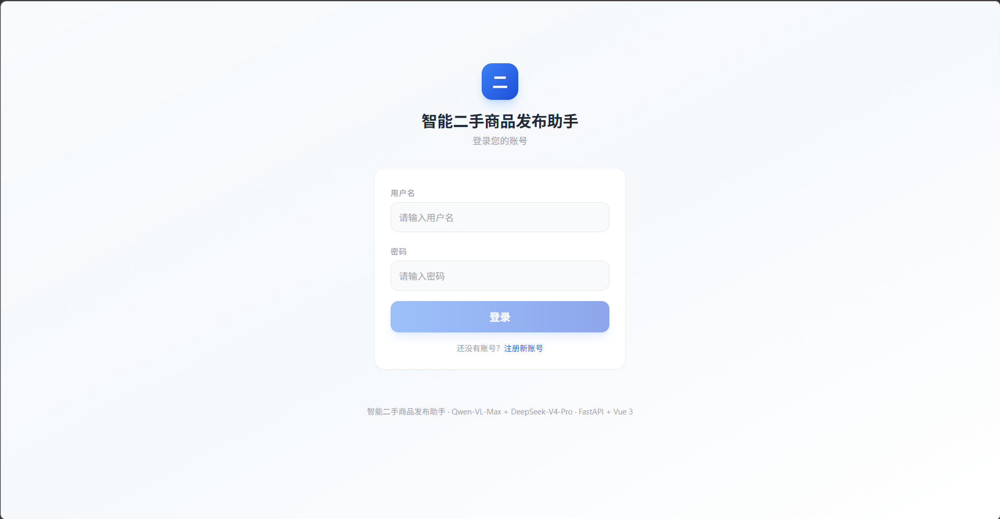
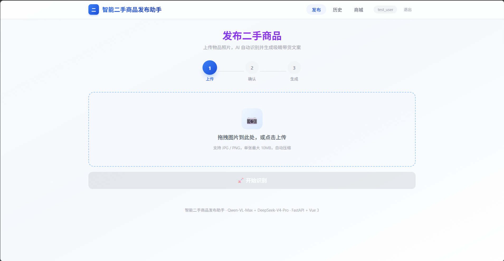
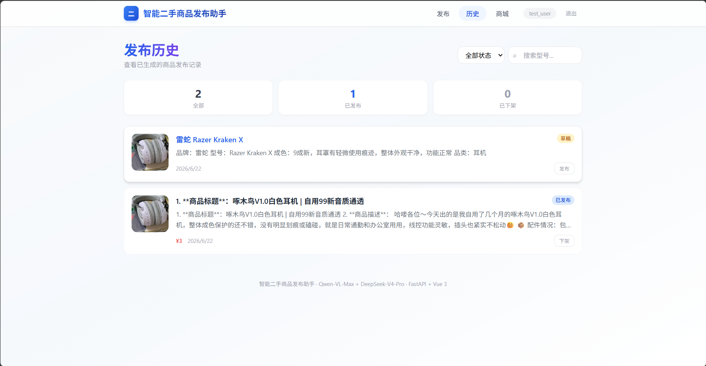
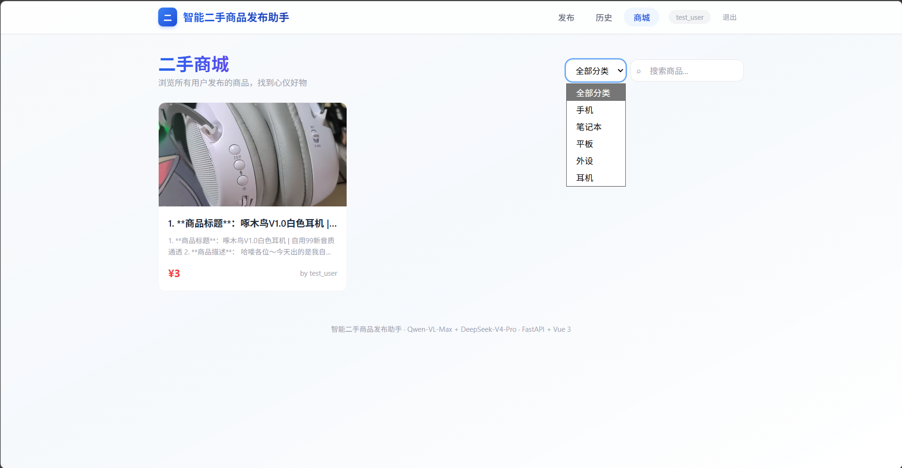

# 项目版本迭代记录

## 版本历史

| 版本号 | 日期 | 更新内容 | 状态 |
|--------|------|----------|------|
| v1.0.0 | 2026-06-23 | 初始版本，完成基础功能 | 已完成 |

---

## v1.0.0（当前版本）

### 技术架构
- **前端**: Vue 3 + Vite + TailwindCSS + Vue Router
- **后端**: FastAPI (Python) + Async 异步编程
- **数据库**: MySQL 8.0
- **密码加密**: PBKDF2-SHA256 (100,000 次迭代 + 16字节盐)

### 已实现功能

#### 1. 用户系统
- 用户注册与登录
- 密码安全加密存储
- 多用户数据隔离

#### 2. 商品发布
- 图片上传（支持多图，最多3张）
- **Qwen-VL-Max** 视觉识别自动提取商品信息
- **DeepSeek-V4-Pro** 智能生成商品描述
- 发布前三级验证（ok/warn/error）

#### 3. 智能验证系统
| 等级 | 标识 | 含义 | 能否发布 |
|------|------|------|----------|
| ok | 绿色 | 验证通过 | 可以发布 |
| warn | 黄色 | 建议检查 | 可以发布 |
| error | 红色 | 错误 | 不可发布 |

#### 4. 商城页面
- 展示所有用户发布的商品
- 支持关键字搜索
- 商品分类筛选

#### 5. 历史管理
- 全部商品
- 已卖出（下架功能）
- 草稿箱（保存未完成的发布）

## 截屏









---

## v2.0（规划中）

### 核心目标
实现自主图像识别能力，降低对外部 API 的依赖，提升二手商品识别的准确性和场景适配性。

---

### 技术升级方案

#### 1. 自训练图像识别模型（替代 Qwen-VL-Max）

**实现策略**:
- **第一步**: 网上收集二手商品数据集，训练初始模型（能够跑通即可）
- **第二步**: 用户上传图片后，同时使用自训练模型和 Qwen-VL-Max 进行识别
- **第三步**: 比对两个模型的结果，如有差异则保存问题样本
- **第四步**: 每周将积累的问题样本加入训练集，进行增量训练

**过拟合避免方案**:
- 每次训练不仅使用本周新数据
- 同时从历史数据中随机抽取样本一起训练
- 采用交叉验证确保模型泛化能力

**技术选型**: CNN/Transformer 混合架构

---

#### 2. YOLO 损伤检测

**背景**: v1.0 仅识别物品类别，未体现二手商品的损耗程度

**实现方案**:
- 引入 YOLO 模型进行损伤区域圈标
- 识别商品的磨损、划痕、污渍等问题
- 将检测结果同步给 DeepSeek 和用户
- DeepSeek 根据损伤程度自动调整价格建议

**输出示例**:
```json
{
  "damage_zones": [
    {"x": 100, "y": 50, "width": 80, "height": 60, "type": "scratch", "confidence": 0.85}
  ],
  "suggested_price_adjustment": -0.15
}
```

---

#### 3. 图片预处理模块

**问题**: 用户上传图片可能存在噪点、模糊、角度偏差等问题

**处理流程**:
```
原始图片 → 去噪处理 → 边缘增强 → 目标裁剪 → 标准化 → 干净图片
```

**技术要点**:
- 使用搜索算法进行去噪
- **注意**: 避免过度去噪导致商品细节丢失
- 保留商品特征同时提升图像质量

---

#### 4. 图片匹配功能（新增）

**背景**: v1.0 仅支持文字匹配商品

**实现方案**:
- 提取每张商品图片的特征值 → 转换为特征向量
- 图片比对时直接比较特征向量
- 支持以图搜图功能

**技术流程**:
```
上传图片 → 特征提取 → 向量转换 → 向量比对 → 返回相似商品
```

---

### 新增功能
- [ ] **自训练图像识别模型**（核心）
- [ ] **YOLO 损伤检测**（二手商品特色）
- [ ] **图片预处理**（提升识别准确率）
- [ ] **图片匹配搜索**（以图搜图）

### 预留接口
```python
# 图像识别抽象接口（已实现）
class LLMClient(ABC):
    @abstractmethod
    async def analyze_image(self, image_path: str, prompt: str) -> dict: pass

    @abstractmethod
    async def generate_text(self, prompt: str, stream: bool = True) -> str: pass

# 新增损伤检测接口
class DamageDetector(ABC):
    @abstractmethod
    async def detect_damage(self, image_path: str) -> list[dict]: pass

# 新增图片特征提取接口
class FeatureExtractor(ABC):
    @abstractmethod
    async def extract_features(self, image_path: str) -> list[float]: pass
```

---

## v3.0（远期规划）

### 愿景
- [ ] **移动端 APP**: 使用 UniApp 开发跨平台移动应用
- [ ] **微信小程序**: 轻量化入口，方便分享传播
- [ ] **AI 客服**: 7x24 小时自动回答用户咨询
- [ ] **交易撮合**: 买卖双方在线议价功能

---

## 版本命名规则

- **主版本号**: 重大架构变更
- **次版本号**: 新功能添加
- **修订号**: Bug 修复和优化

示例: v1.2.3
- 1: 主版本
- 2: 次版本（新功能）
- 3: 修订（修复）

---

## 升级注意事项

### v1.x → v2.0 数据库迁移
```sql
-- 预留字段用于未来扩展
ALTER TABLE products ADD COLUMN ai_model VARCHAR(50) DEFAULT 'qwen_vl_max';
ALTER TABLE products ADD COLUMN confidence_score FLOAT;
```

### API 兼容性
- 所有外部 API 调用通过 `app/llm/` 目录下的客户端封装
- 更换模型只需实现相同接口，不影响业务逻辑
